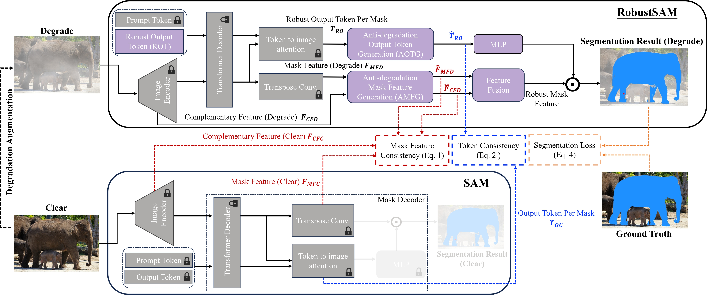
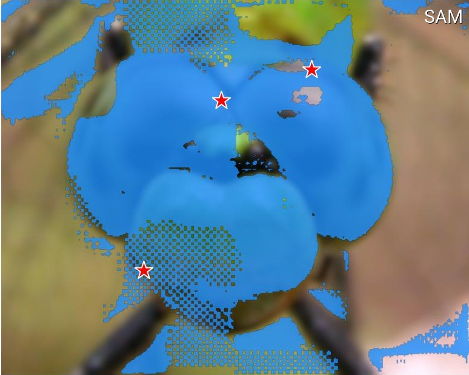
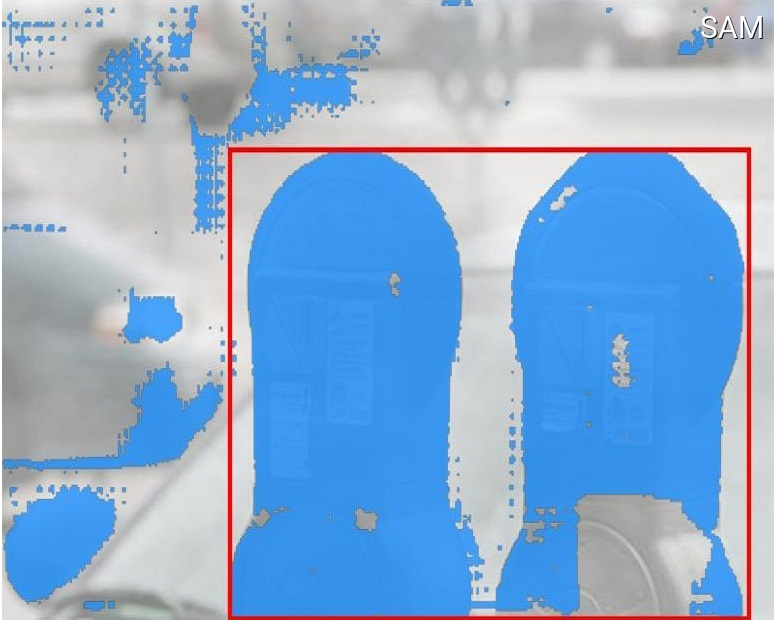
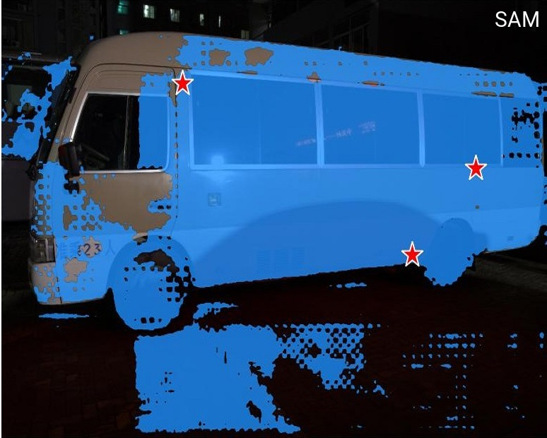
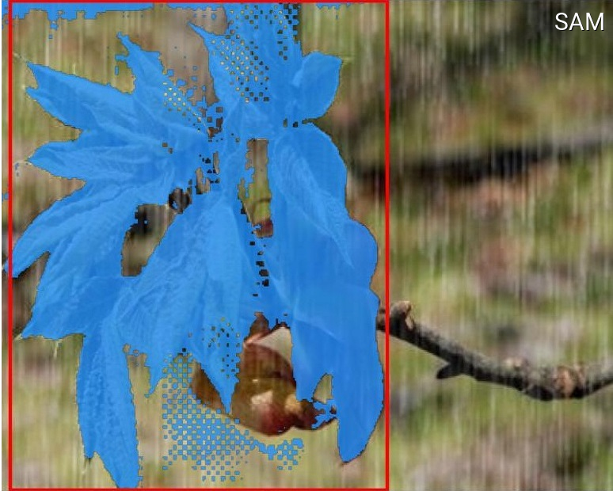
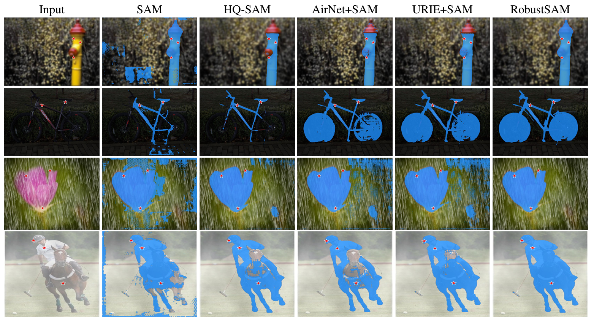
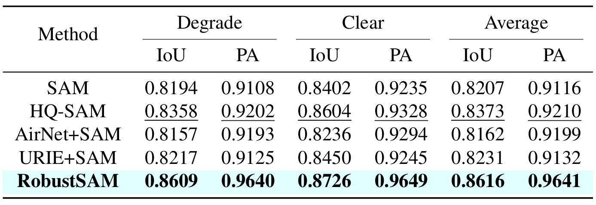
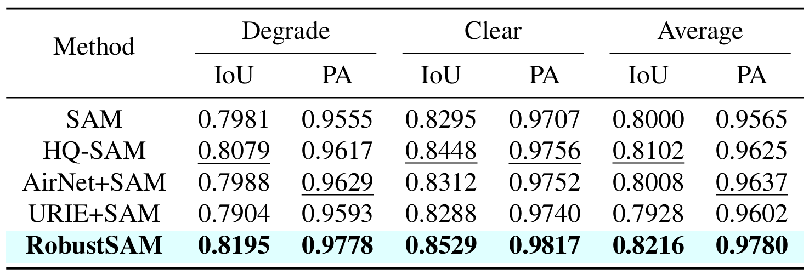
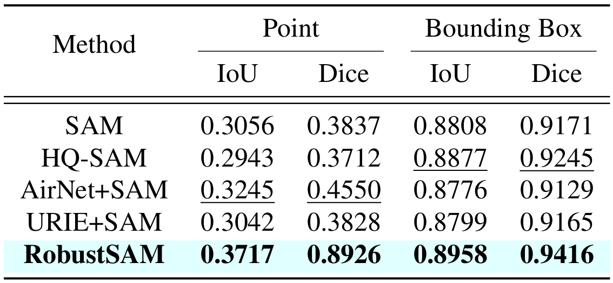

# RobustSAM: Segment Anything Robustly on Degraded Images (CVPR 2024 Highlight)

<a href="https://colab.research.google.com/drive/1mrOjUNFrfZ2vuTnWrfl9ebAQov3a9S6E?usp=sharing"></a>
[](https://huggingface.co/robustsam/robustsam/tree/main)
You can refer Hugginface model cards built by @jadechoghari:
[](https://github.com/robustsam/RobustSAM/issues/10#issuecomment-2294327808)


Official repository for RobustSAM: Segment Anything Robustly on Degraded Images

[Project Page](https://robustsam.github.io/) | [Paper](https://openaccess.thecvf.com/content/CVPR2024/html/Chen_RobustSAM_Segment_Anything_Robustly_on_Degraded_Images_CVPR_2024_paper.html) | [Video](https://www.youtube.com/watch?v=Awukqkbs6zM) | [Dataset](https://huggingface.co/robustsam/robustsam/tree/main/dataset)


## Updates
- July 2024: ✨ Training code, data and model checkpoints for different ViT backbones are released!
- June 2024: ✨ Inference code has been released!
- Feb 2024: ✨ RobustSAM was accepted into CVPR 2024!


## Introduction
Segment Anything Model (SAM) has emerged as a transformative approach in image segmentation, acclaimed for its robust zero-shot segmentation capabilities and flexible prompting system. Nonetheless, its performance is challenged by images with degraded quality. Addressing this limitation, we propose the Robust Segment Anything Model (RobustSAM), which enhances SAM's performance on low-quality images while preserving its promptability and zero-shot generalization.

Our method leverages the pre-trained SAM model with only marginal parameter increments and computational requirements. The additional parameters of RobustSAM can be optimized within 30 hours on eight GPUs, demonstrating its feasibility and practicality for typical research laboratories. We also introduce the Robust-Seg dataset, a collection of 688K image-mask pairs with different degradations designed to train and evaluate our model optimally. Extensive experiments across various segmentation tasks and datasets confirm RobustSAM's superior performance, especially under zero-shot conditions, underscoring its potential for extensive real-world application. Additionally, our method has been shown to effectively improve the performance of SAM-based downstream tasks such as single image dehazing and deblurring.



## Setup
1) Create a conda environment and activate it.
```
conda create --name robustsam python=3.10 -y
conda activate robustsam
```
2) Clone and enter into repo directory.
```
git clone https://github.com/robustsam/RobustSAM
cd RobustSAM
```
3) Use command below to check your CUDA version.
```
nvidia-smi
```
4) Replace the CUDA version with yours in command below.
```
pip install torch torchvision torchaudio --index-url https://download.pytorch.org/whl/cu[$YOUR_CUDA_VERSION]
# For example: pip install torch torchvision torchaudio --index-url https://download.pytorch.org/whl/cu117 # cu117 = CUDA_version_11.7
```
5) Install remaining dependencies
```
pip install -r requirements.txt
```

6) Download pretrained RobustSAM checkpoints of different sizes and place them into current directory.
   - [ViT-B RobustSAM checkpoint](https://huggingface.co/robustsam/robustsam/resolve/main/model_checkpoint/robustsam_checkpoint_b.pth)
   - [ViT-L RobustSAM checkpoint](https://huggingface.co/robustsam/robustsam/resolve/main/model_checkpoint/robustsam_checkpoint_l.pth)
   - [ViT-H RobustSAM checkpoint](https://huggingface.co/robustsam/robustsam/resolve/main/model_checkpoint/robustsam_checkpoint_h.pth)

## Data Preparation
1) Change current directory to "data" directory.
```
cd data
```
2) Download train, val, test and extra COCO & LVIS dataset. (NOTE: Images in train, val and test dataset consist images from [LVIS](https://paperswithcode.com/paper/lvis-a-dataset-for-large-vocabulary-instance-1), [MSRA10K](https://paperswithcode.com/dataset/msra10k), [ThinObject-5k](https://github.com/liewjunhao/thin-object-selection), [NDD20](https://arxiv.org/abs/2005.13359), [STREETS](https://paperswithcode.com/dataset/streets) and [FSS-1000](https://github.com/HKUSTCV/FSS-1000))
```
bash download.sh
```
3) There are only clear images downloaded in the previous step. Use command below to generate corresponding degraded images. 
```
bash gen_data.sh
```

## Training
1) If you want to train from scratch, use command below.
```
python -m torch.distributed.launch train_ddp.py  --multiprocessing-distributed --exp_name [$YOUR_EXP_NAME] --model_size [$MODEL_SIZE]
# Example usage: python -m torch.distributed.launch train_ddp.py  --multiprocessing-distributed --exp_name test --model_size l
```
2) If you want to train from pretrained checkpoint, use command below.
```
python -m torch.distributed.launch train_ddp.py  --multiprocessing-distributed --exp_name [$YOUR_EXP_NAME] --model_size [$MODEL_SIZE] --load_model [$CHECKPOINT_PATH]
# Example usage: python -m torch.distributed.launch train_ddp.py  --multiprocessing-distributed --exp_name test --model_size l --load_model robustsam_checkpoint_l.pth
```

## Demo
We have prepared some images im **demo_images** folder for demo purpose. Besides, two prompting modes are available (box prompts and point prompts).
- For box prompt:
```
python eval.py --bbox --model_size l
```
- For point prompt:
```
python eval.py --model_size l
```
In default, demo results will be saved to **demo_result/[$PROMPT_TYPE]**.

## Comparison of computational requirements


## Visual Comparison
<table>
  <tr>
    <td>
      
    </td>
    <td>
      
    </td>
  </tr>
  <tr>
    <td>
      
    </td>
    <td>
      
    </td>
  </tr>
</table>



## Quantitative Comparison
### Seen dataset with synthetic degradation


### Unseen dataset with synthetic degradation


### Unseen dataset with real degradation


## Reference
If you find this work useful, please consider citing us!
```python
@inproceedings{chen2024robustsam,
  title={RobustSAM: Segment Anything Robustly on Degraded Images},
  author={Chen, Wei-Ting and Vong, Yu-Jiet and Kuo, Sy-Yen and Ma, Sizhou and Wang, Jian},
  journal={CVPR},
  year={2024}
}
```


## Acknowledgements
We thank the authors of [SAM](https://github.com/facebookresearch/segment-anything) from which our repo is based off of.

